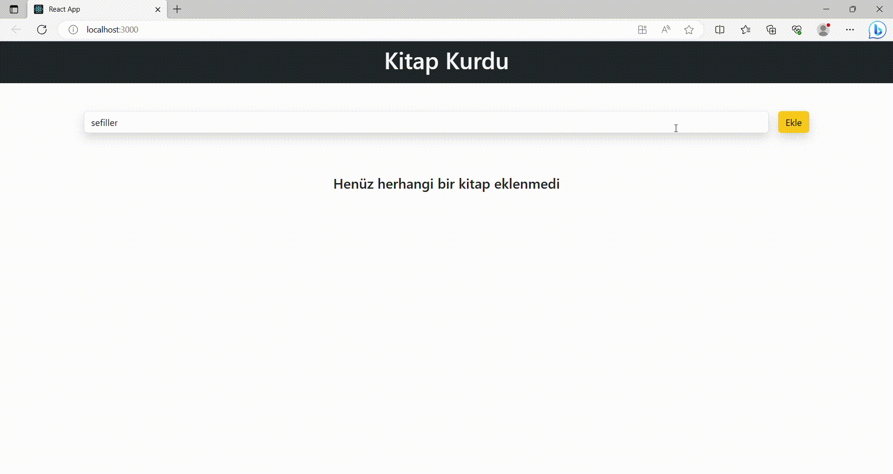

# CRUD App

- Create Read Update Delete
- Oluştur Oku Düzenle Sil

* - Form içerisinden kitap ismini al.

- - Eğer ki kitap ismi girilmişse:
- - Ekle butonuna tıklanınca kitap ismiyle yeni bir obje oluştur
- - Eklenme Tarihi | Kitap İsmi | id | okunduMu
- - Oluşan objeyi kitapların tümünü tuttuğumuz state ' e aktar
- - İnputu temizle

* `books` state'inde tutulan kitapları al ve ekrana bas
* - Eğer state boşsa "henüz kitap eklenmedi" ekrana bas
* - Dizideki herbir kitap icin ekrana `BookCard` bileşeni bas
* - `BookCard` ' a prop olarak ekrana basılacak kitap bilgilerini aktar

* Kitap Silme:
* - herhangi bir kitabın sil butonuna basıldığında fonk. calıstır
* - fonksiyona silinecek id 'sine gönder
* - bu fonksıyon ekran modal 'ı acsın
* - ve modal'a silinecekID 'yi gönder

* Okundu İşaretleme:
* - okundu butonuna tıklanınca fonk calıstır
* - bu fonksiyona kitabın değerlerini gönder
* - kitabın isRead değerini tersine cevir
* - state i güncelle

* Düzenleme:
* - Düzenle butonuna tıklandıgında fonk. calıssın
* - Fonksiyon modal ı acsın ve düzenlenecek elemanı state ' e aktarsın
* - Düzenlenecek eleman modaldaki inputa gelsin(prop gönder)
* - input degistıgınde düzenlenecek elemanın title ını degıstır
* - vazgec > modal ı kapat
* - kaydet > düzenlenecek elemanı `books` statine aktaracak fonksiyonu calıstır

### 'screen'

# kitap-kurdu-react
